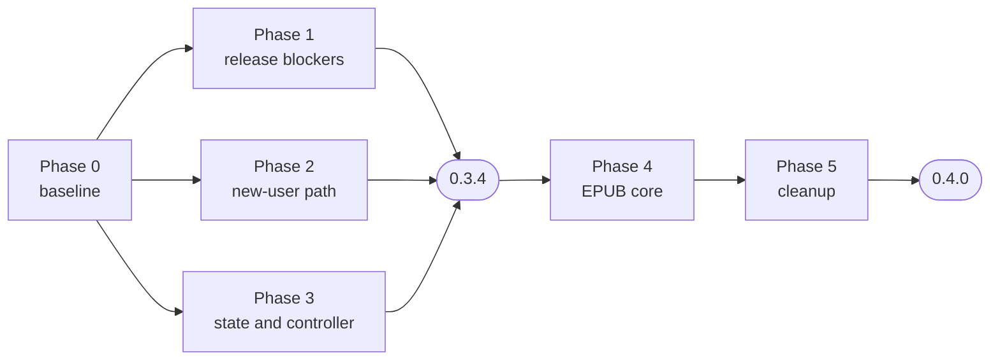

# Implementation plan: improving tepub in place

Written 2026-10-05. Source material: `dev-docs/research/01-improving-tepub.md`
(defect ids E, C, N, A, P, W are its ids) and `02-rewriting-tepub.md`
(feature ids F). Base: `origin/main` at `01e7360`, v0.3.3. Origin was
re-checked on the date above and had not moved.

## Assumptions, until the owner says otherwise

| Assumption | If it is wrong |
|---|---|
| Staged path: phases 0 to 3 ship as 0.3.4, phase 4 replaces the EPUB core in Python and ships as 0.4.0 | Patch-only stops after phase 3 and drops phase 4 |
| Work happens on a branch off a fast-forwarded `main`, one commit per work item, nothing pushed | Nothing in the plan changes except where commits land |
| Real-world EPUBs for fixtures come from a folder the owner names, and stay outside the repo | Phase 4 runs on the three tiny samples only, and its gate is weaker; say so in the release notes |
| Python stays. The TypeScript rewrite and the paper-one capability are later options that nothing here blocks | Stop after phase 3 |

## Rules for every work item

- **The failing test comes first**, and is committed in the same commit as the fix. A test that has never failed proves nothing.
- **Done means a command passes**, and the command is written in the item. "Looks right" is not done.
- **The full suite stays green after every item**, run with HOME isolated. A red suite stops the next item.
- **A fixed silent failure leaves an assertion behind** that makes it loud if it returns.
- **Status is stamped into this file** as each item lands: `DONE <date>`, the commit, the command that verified it, and anything that did not go as planned.

## Phase overview

Phases 1, 2 and 3 touch different modules and can run in any order after
phase 0.

---

## Phase 0: baseline

### WI-0.1 Get onto current code
**Status:** DONE 2026-10-05. `main` fast-forwarded to `01e7360`; work on `improve/0.3.4`; scratch worktrees removed, `git worktree list` shows one entry.
**Do:** fast-forward local `main` to `origin/main`; create branch `improve/0.3.4`; remove stale worktrees under `/tmp`.
**Done when:** `git rev-parse main` equals `git rev-parse origin/main`, and `git worktree list` shows one entry.

### WI-0.2 Isolate tests from the user's machine
**Status:** DONE 2026-10-05, `99d8764`. Verified: `tests/test_isolation.py` (11 tests). Not as planned: rather than vendoring NLTK data, the fixture finds `punkt_tab` where a developer or CI already put it and pins `NLTK_DATA` there; with none present the three sentence tests skip with the install command, so real and empty HOME give the same failures and differ only in those named skips. CI downloads the data before the test step. The same commit set also pinned the publish action (`474a3f8`), flagged by a security review while editing the workflow.
**Files:** `tests/conftest.py`
**Do:** an autouse fixture that points `HOME` and `TEPUB_WORK_ROOT` at a temporary directory and clears provider keys from the environment. A second fixture provides NLTK `punkt_tab` from a vendored copy under `tests/fixtures/`, or skips with a named reason when absent; never a network download inside a test.
**Test first:** a test that writes a broken `~/.tepub/config.yaml` into the real-HOME location it would have read, and asserts `load_settings()` does not see it.
**Done when:** `HOME=/tmp/empty python -m pytest -q --no-cov` and the same run with the real HOME report identical results.

### WI-0.3 A baseline gate script
**Status:** DONE 2026-10-05, `d1f82da`. Verified: on the tree before WI-1.1 the script stopped at the test step with the chapter-marker test as the only failure. Also moved ruff's `select`/`ignore` under `[tool.ruff.lint]`, which ruff had deprecated.
**Files:** `scripts/verify.sh` (new)
**Do:** one script running ruff (F, E9), the test suite, and, once phase 4 exists, epubcheck over the fixture outputs. It exits non-zero on the first failure and prints which step failed.
**Done when:** the script exits 1 on today's tree, naming the chapter-marker test, and that is the only failure.

### WI-0.4 Opt-in live model tests
**Status:** DONE 2026-10-05. A TranslateGemma 12B model on a self-hosted Ollama server is the live endpoint. Verified: without `TEPUB_LIVE_BASE_URL` the 5 tests skip with that reason; with it all 5 pass: translation through the Ollama native, chat-completions and Responses shapes, and truncation refused on the real `done_reason: length` and `finish_reason: length` signals. The Responses shape's truncation signal stays unconfirmed: Ollama ignores `max_output_tokens`. Python's HTTP client sees no proxy for the host, so the Mac's system proxy is not in the path.
**Files:** `tests/live/` (new), `tests/conftest.py` marker
**Do:** tests marked `live` run only when `TEPUB_LIVE_BASE_URL` is set, against any OpenAI-compatible endpoint. They never run in CI or in the default suite. They exist to measure what fakes cannot: refusal and truncation signals (WI-2.3), the error classes (WI-2.4), and whether a real model keeps the inline-markup contract (WI-4.5).
**Done when:** `python -m pytest -m live` skips with a named reason when the variable is unset, and passes against the live endpoint when it is set.

---

## Phase 1: release blockers

Each of these reports success while producing wrong output.

### WI-1.1 Chapter markers in the right unit (A1)
**Status:** DONE 2026-10-05. Verified: `test_chapter_starts_do_not_depend_on_the_movie_timescale` failed at timescales 11025 and 24000 and passed at 1000 before the fix, and passes at all three after it, read back by both mutagen and ffprobe. Beyond the plan: the writer now verifies every start time on read-back and raises `ChapterVerificationError` (pinned by `test_wrong_chapter_times_are_refused`), and assembly no longer logs and continues when chapter writing fails.
**Files:** `src/audiobook/mp4chapters.py`
**Do:** write `chpl` start times as `round(seconds * 10_000_000)`; delete the timescale lookup and its use of mutagen private methods for timescale.
**Test first:** the existing `test_write_chapter_markers_roundtrip`, plus a new test that writes markers into a file whose movie timescale is 24000 and reads them back with ffprobe as well as mutagen.
**Done when:** both readers report each marker within 10 ms of its intended time, for timescales 1000, 11025 and 24000.

### WI-1.2 Footnote filtering actually runs (A2, A12)
**Status:** DONE 2026-10-05. Verified: `tests/audiobook/test_footnotes_real_epub.py` against an EPUB built by the new `tests/epub_builder.py` (4 of 5 failed before the fix); corpus run over 19 real books: no crash, no fallback, and every dropped segment classified as a marked note section (`rearnotes`, `footnote`) or text with no words. Not as planned: id-token matching is kept, because EPUB 2 books mark notes only by ids such as `ftn3`; a bare `note` is accepted in ids but not in classes. Folded in from WI-5.2: A6 (segment-id substring filter that dropped `authors_note.xhtml`) and the unreachable xpath-predicate check. Two mock tests that enshrined the old behaviour were replaced, not deleted: see the commit body.
**Files:** `src/epub_io/reader.py`, `src/audiobook/preprocess.py`
**Do:** give `EpubReader` the document lookup that `preprocess.py` calls; replace the bare `except Exception` around it with a narrow exception that is logged with the file name; restrict footnote-definition detection to `epub:type` and DPUB-ARIA roles, dropping the `class="note"` heuristic that would remove admonition boxes.
**Test first:** a test against a real EPUB fixture, not a `Mock()`, asserting a note body is excluded and a `
` admonition is kept.
**Done when:** that test passes and `grep -n "except Exception" src/audiobook/preprocess.py` finds nothing around the reader call.

### WI-1.3 Pauses at the speech sample rate (A3)
**Status:** DONE 2026-10-05, together with WI-1.4 in one helper, `src/audiobook/concat.py`, because both are the same defect class: concatenation that never checked its result. Silence is generated by ffmpeg in the format of the speech beside it, and inputs in different formats are refused. Verified: `tests/audiobook/test_concat.py` decodes the output; a 3 s pause between two 1 s tones decodes to 5.0 s.
**Files:** `src/audiobook/assembly.py`
**Do:** generate silence at the frame rate of the first rendered segment, not pydub's 11025 Hz default, at every call site.
**Test first:** concatenate two tone segments with a 3 s pause and assert the decoded duration from ffprobe equals the sum within 50 ms.
**Done when:** that test passes and ffmpeg's stderr for the concat contains no "Non-monotonic DTS".

### WI-1.4 One concat helper that cannot truncate (A4)
**Status:** DONE 2026-10-05, see WI-1.3. Every concat list is built by one escaping function; after each concat the output's duration must equal the sum of its inputs or `ConcatError` is raised; ffmpeg's stderr is carried in the error. Verified: apostrophe-path test keeps all three inputs; `test_a_short_output_is_refused` simulates the old truncation and is refused. Not as planned: output length is checked from container durations, not by decoding the whole book, which is sound because mixed formats, the case where container durations lie, are refused first. Also replaced `expected_chapters.index(...)`, a deep-equality scan per chapter, with `enumerate`.
**Files:** `src/audiobook/assembly.py`
**Do:** route every concat list through one function that escapes paths, and after every ffmpeg concat assert the output duration is within tolerance of the sum of inputs; raise with ffmpeg's stderr when it is not.
**Test first:** a work directory whose path contains an apostrophe, with three segments; assert all three are in the output.
**Done when:** that test passes and `grep -n "file '" src/audiobook/assembly.py` finds only the helper.

### WI-1.5 End-to-end assembly test
**Status:** DONE 2026-10-05. Verified: `tests/audiobook/test_assembly_e2e.py` (3 tests) passes; putting back each old defect in turn made it fail: chapter unit (read-back refused, 72.9 s for 3.0 s), 11025 Hz silence (concat refused the mixed rates), unescaped apostrophe (ffmpeg error carried in `ConcatError`). It also found a defect on its first run: statements were rendered into a folder not yet created, and a catch-all logged the failure and assembled the book without them. The folder is now created first, a failed statement stops assembly, and an invalid statement template names its placeholders (part of A9).
**Depends:** WI-1.1 to WI-1.4
**Files:** `tests/audiobook/test_assembly_e2e.py` (new)
**Do:** two chapters of tone segments with a fake TTS engine, through `assemble_audiobook`, checked with ffprobe for duration, chapter count, chapter starts and cover art.
**Done when:** the test passes, and reverting any one of WI-1.1, 1.3 or 1.4 makes it fail. Record that check in the status line.

---

## Phase 2: the path a new user walks

### WI-2.1 `.env` keys reach the providers (C2)
**Status:** DONE 2026-10-05. Verified: `tests/config/test_dotenv.py` (6 of 8 failed before): keys for all five providers reach the environment, the OpenAI provider sends the `.env` key in its Authorization header, an exported variable wins over `.env`, and lowercase `.env` entries still act as settings. Not as planned: `.env` is not removed from the settings payload, because lowercase entries such as `target_language` are an existing use; entries shaped like environment variable names are exported instead. Follow-up after a security review: only the six variables tepub reads may be exported from `.env`; anything else variable-shaped is ignored with a warning, and a test ties that list to the names the source reads.
**Files:** `src/config/loader.py`
**Do:** load `.env` into the process environment without overwriting variables already set, and stop merging it into the settings payload.
**Test first:** a `.env` with `OPENAI_API_KEY` in a temp directory; assert the OpenAI provider sends that key.
**Done when:** the test passes for OpenAI, Anthropic, Gemini, DeepL and Grok.

### WI-2.2 Braces in a custom prompt are text (C7)
**Status:** DONE 2026-10-05. Verified: `tests/config/test_placeholders.py`. Both user-template sites, the custom prompt and the audiobook statements, now use `config/placeholders.py`, which fills only offered names, leaves other braces as text, and still treats a doubled brace as one, so existing templates keep working. This supersedes the statement-template error added in WI-1.5.
**Files:** `src/translation/prompt_builder.py`
**Do:** substitute only the documented placeholders by name; leave every other brace as written.
**Test first:** a preamble containing `{"a": 1}` and `{target_language}`; assert the JSON survives and the placeholder is filled.

### WI-2.3 Refusals and truncations are never COMPLETED (C6)
**Status:** DONE 2026-10-05. Verified: `tests/translation/test_reply_checks.py` and the extended `test_refusal_filter.py` (7 failed before). Not as planned: running the filter on every reply exposed false positives for books translated into English ("I cannot believe it", "I'm sorry, I can't come tonight"), so a refusal must now name the task (translate, help, request, content, and Chinese equivalents) unless it self-identifies as a model, and a reply whose source itself reads like a refusal is kept. Truncation signals follow each API's documented field (Responses `status: incomplete`, chat `finish_reason: length`, Ollama `done_reason: length`, Gemini `MAX_TOKENS`); WI-0.4's live tests are where a real endpoint confirms them.
**Files:** `src/translation/controller.py`, `src/translation/providers/*.py`
**Do:** run `looks_like_refusal` on every result before marking it complete; each provider reports truncation from its own stop signal; a refused or truncated unit is marked ERROR with the reason.
**Test first:** a fake provider returning a refusal, and one reporting truncation; assert both end as ERROR.

### WI-2.4 Transient errors are retried, fatal ones stop the run (N1, N2, C8)
**Status:** DONE 2026-10-05. Verified: `tests/translation/test_error_classes.py` (17), `test_a_cooldown_resumes_the_run`, `test_cooldowns_are_capped`. Classification lives in `providers/base.py`: 401/403/404 fatal; 408, 409, 425, 429, 5xx and 529 retried with `Retry-After` honoured up to 60 s; other 4xx fail only their segment, where a 400 used to end the run. Anthropic and Gemini classify SDK exceptions by the status they carry; DeepL now posts through the shared helper. A cooldown resumes the next pass, at most 3 per run. The cooldown counts down by time slept, so it is bounded and testable. Not done here: `datetime.utcnow()` deprecations elsewhere, left for WI-3.1, which rewrites the state path.
**Files:** `src/translation/controller.py`, `src/translation/providers/http.py`, `anthropic.py`, `gemini.py`, `deepl.py`
**Do:** classify errors in one place: 401 and 403 and missing keys are fatal; 408, 429 and 5xx are transient. Honour `Retry-After`. After a cooldown, resume the pass instead of exiting.
**Test first:** a fake provider failing three times with 429 then succeeding; assert the run completes with no segment left PENDING, using an injected clock so the test does not sleep.

### WI-2.5 A provider change does not silently erase work (C4)
**Status:** open
**Files:** `src/state/store.py`, `src/translation/controller.py`
**Do:** changing provider or model keeps completed translations. Changing source or target language resets, but writes a timestamped backup first and prints what it reset.
**Test first:** completed state, switch model; assert translations kept. Switch target language; assert backup exists and the message names the count.

### WI-2.6 Remove configuration that does nothing (C9)
**Status:** open
**Files:** `src/config/models.py`, `config.example.yaml`, `src/config/templates.py`
**Do:** delete `retry`, `rate_limit` and `fallback_provider`, or wire them; the default is delete. An unknown key in a user's config produces a warning naming it.
**Done when:** `grep -rn "rate_limit\|fallback_provider" src` finds nothing, and a test asserts the warning.

---

## Phase 3: state and controller

### WI-3.1 State writes in constant time per segment (P1, C10)
**Status:** open
**Files:** `src/state/store.py`, `src/state/base.py`, `src/translation/controller.py`
**Do:** the controller holds `StateDocument` in memory with a single writer; it flushes every N results or T seconds, and on exit, interrupt or error. A sidecar lock is held for the whole run, so a second process on the same workspace refuses to start.
**Test first:** a benchmark test over 5000 fake segments asserting total state I/O stays under 5 full-file writes per 100 segments; a test that a second process is refused; a test that a kill after a flush loses at most one batch.
**Done when:** the measured per-segment overhead on the 5000-record file falls from about 400 ms to under 5 ms.

### WI-3.2 Interrupt exits promptly and non-zero (A7, A8)
**Status:** open
**Files:** `src/audiobook/controller.py`, `src/translation/controller.py`
**Do:** Ctrl-C cancels queued work, signals in-flight workers through an event they check instead of `time.sleep`, flushes state, and exits 130.
**Test first:** a subprocess test that sends SIGINT mid-run and asserts exit within 2 s with code 130 and state flushed.

### WI-3.3 Tests for the state store and resume
**Status:** open
**Files:** `tests/state/test_store.py` (new)
**Do:** cover `ensure_state`, `mark_status`, `reset_error_segments`, resume after an interrupted run, and the retry pass.

### Release 0.3.4
**Done when:** `scripts/verify.sh` exits 0; the changelog lists every work item by id; the version is bumped. Pushing and tagging wait for the owner.

---

## Phase 4: the EPUB core, replaced in Python

Decision gate before starting: the owner confirms the staged path, and the
design below is sent to a second model in refute mode with checkable
objections. Any objection whose check fails blocks the phase until resolved.

### WI-4.0 Fixture corpus and the epubcheck gate
**Status:** open
**Files:** `tests/fixtures/epub/` (small, committed, licence-clean), `tests/corpus/` (a local folder named by `TEPUB_CORPUS_DIR`, never committed)
**Do:** committed fixtures cover: nested blockquotes, `epub:switch`, inline SVG cover, MathML, footnotes with backlinks, a NCX-only EPUB 2, a nav-only EPUB 3, files with the same basename in two directories, and a vertical CJK book. A round-trip test reads each fixture, writes it with no edits, and asserts every zip entry except the mimetype order is byte-identical, then runs epubcheck on the output.
**Done when:** the round-trip test exists and fails on today's writer for the reasons E1 and E2 describe.

### WI-4.1 A byte-copy writer (E1, E2, E3, E15, F02)
**Status:** open
**Depends:** WI-4.0
**Files:** `src/epub_io/container.py` (new), `src/epub_io/writer.py`
**Do:** read the container and package with lxml's XML parser. Write output by copying every entry untouched except the documents passed in, with `mimetype` first and stored uncompressed. TOC title rewrites edit the nav or NCX document directly. ebooklib leaves the write path entirely.
**Done when:** the WI-4.0 round-trip test passes, and epubcheck on every committed fixture's bilingual and translated outputs reports no errors that the input did not already have.

### WI-4.2 Parse content documents as XML (E4, E5, E6)
**Status:** open
**Depends:** WI-4.1
**Files:** `src/epub_io/reader.py`, `src/epub_io/xhtml.py` (new)
**Do:** parse with the XML parser, preserving declaration and doctype, resolving HTML named entities first. If XML parsing fails, fall back to the HTML parser, log the file name as a warning, and still serialize as well-formed XHTML.
**Test first:** probes P7 and P8 from the research appendix, rewritten as assertions: `viewBox` survives, `epub:switch` content is extracted and injected without error, output parses as XML.

### WI-4.3 One segmentation rule (E7, E8, F04)
**Status:** open
**Depends:** WI-4.2
**Files:** `src/extraction/segments.py`
**Do:** a block element is a unit if it has no block descendants; `table`, `ul`, `ol`, `dl` and `figure` are units as a whole and nothing inside them is. Delete the smart-extraction special cases this replaces.
**Test first:** P1 and P6 as assertions; a property test that no two units overlap and every text node in a body block belongs to exactly one unit.

### WI-4.4 Stable unit ids and a workspace importer (E12, E13, F21)
**Status:** open
**Depends:** WI-4.3
**Files:** `src/extraction/segments.py`, `src/injection/engine.py`, `src/state/migrate.py` (new)
**Do:** each unit gets an id derived from the full EPUB-relative path plus its order, written into the working copy of the document as a `data-tepub-id` attribute, never into the output. Injection finds units by id, so reverse-order insertion is no longer needed. The importer maps a legacy workspace by file path plus `order_in_file`, copies completed translations, refuses to run twice, and reports anything it could not map.
**Test first:** P2 as an assertion; a legacy workspace fixture imported with zero unmapped completed translations.

### WI-4.5 Inline markup survives translation (E9, E10, F05)
**Status:** open
**Depends:** WI-4.4
**Files:** `src/extraction/segments.py`, `src/translation/prompt_builder.py`, `src/translation/validate.py` (new), `src/injection/html_ops.py`
**Do:** every unit is sent as inner HTML. The response must contain the same multiset of inline tags with the same `href` and `id` values. A mismatch is retried once with the mismatch named in the prompt, then marked ERROR. Translated-only output keeps every child id and note reference.
**Test first:** P4 and P5 as assertions; validator tests for a dropped link, a renamed id, an added tag.

### WI-4.6 Bilingual and translated-only rendering on the new core (F11)
**Status:** open
**Depends:** WI-4.5
**Files:** `src/injection/engine.py`, `src/epub_io/writer.py`
**Do:** both modes render from the same unit store. Translated-only removes originals instead of hiding them with CSS, so no stylesheet edit is needed.
**Done when:** epubcheck passes on both outputs for every fixture, and the owner's corpus run reports its counts in the status line.

---

## Phase 5: cleanup the above exposes

### WI-5.1 Split `assembly.py` (843 lines)
**Status:** open
**Do:** chapter plan, concat, tagging and statements become separate modules; behaviour is pinned by WI-1.5 before the split.

### WI-5.2 Remaining audiobook defects (A5, A9, A10, A11, A13, A14)
**Status:** open
**Do:** check the NLTK download result and fail loudly; catch template errors before synthesis; warn about content outside the TOC; full-width terminators only for CJK splitting; filter the chapter preview the way assembly does; scope the NLTK environment variable.

### WI-5.3 CLI routing and the workspace move (N4, N5)
**Status:** open
**Do:** every command resolves the workspace through one function; a moved EPUB can be re-bound with an explicit flag.

### WI-5.4 Web builder keeps classes and lang (W1)
**Status:** open

### Release 0.4.0
**Done when:** `scripts/verify.sh` exits 0 including epubcheck on fixtures; the importer is documented in the changelog; the owner's corpus run is recorded.

---

## Effort

| Phase | Agent-hours | Irreducible design inside it | Clock-time waits |
|---|---|---|---|
| 0 | 0.5 | None | None |
| 1 | 1.5 | None | None |
| 2 | 2 | Error classification | None |
| 3 | 2 to 3 | Flush policy | None |
| 4 | 8 to 10 | Segmentation rule; inline-markup contract; id scheme | Collecting the fixture corpus; the refute-mode review |
| 5 | 2 to 3 | None | None |

About 16 to 20 agent-hours in total. The 0.3.4 release is about 6 of them.

## Owner answers, 2026-10-05

| Question | Answer |
|---|---|
| Staged or patch-only | Staged: phases 0 to 5 |
| Fast-forward `main`, work on a branch, commit per item, no push | Yes |
| Real books for the corpus run | A local folder named by `TEPUB_CORPUS_DIR`, never committed |
| Dead config keys | Delete |
| Live model for testing | A Gemma translation model on a self-hosted OpenAI-compatible endpoint; see WI-0.4 |
