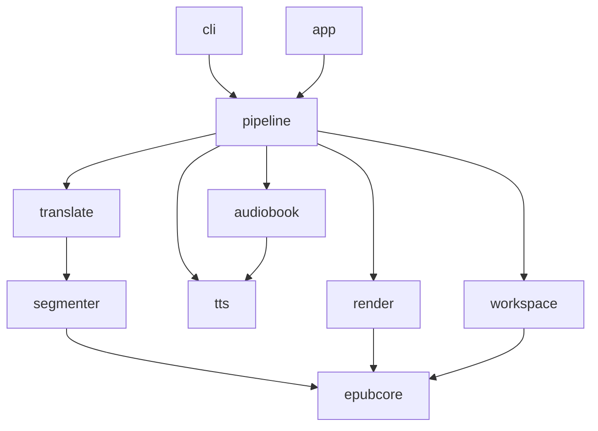

# Rewriting tepub: feature ledger, stack, modules, GUI

Written 2026-09-23. Companion to `01-improving-tepub.md`, whose section F
explains why the EPUB core cannot be patched in place. This file answers four
questions: what a complete rewrite must carry, in what stack, in what module
shape, and what happens if users need a GUI.

If the engine is to live inside paper-one instead, read
`03-integrating-into-paper-one.md`; the ledger and the module rules below still
apply, the packaging and GUI sections do not.

## Decision

A TypeScript, library-first monorepo. The CLI is the first client and any GUI
is the second; neither holds business logic.

The mechanism that makes this beat a Python rewrite is the owner's own
ecosystem. Aficionado and paper-one are Tauri 2 + React 19 EPUB readers that
vendor foliate-js, including a complete EPUB CFI implementation. Aficionado has
a translation runner and Edge and OpenAI TTS integration. cjk-typography is the
TypeScript port of cjk-text-formatter. Today two translation and TTS engines
exist in two languages. One TypeScript core lets the CLI and the readers share
one.

The one real cost is XML fidelity. lxml is better than any Node XML library.
The byte-copy design below removes most of that exposure, because only the
documents that change are re-serialized, and an epubcheck gate over a fixture
corpus catches what is left.

Alternatives considered:

| Option | Why not |
|---|---|
| Python, rewrite the core in place | Keeps lxml and is cheaper if a GUI never happens. Leaves two engines forever, and a GUI would be a local web server or a packaged sidecar |
| Rust core with Tauri commands | Native fit for the readers. Provider and TTS churn is where the work is, every client is hand-written, and performance is irrelevant for an I/O-bound tool |

## Feature ledger

A ledger is a checked-in file with one row per feature. Each row names a
verdict, the fixture that proves it, and the test ids tagged with the row's id.
CI asserts that every row whose verdict is not Drop has at least one tagged
test. The rewrite is finished when every row is green, so nothing is lost
silently.

Initial rows, derived from the current code:

| ID | Feature | Verdict | Note |
|---|---|---|---|
| F01 | EPUB 2 and 3 ingest: container, package, spine, NCX and nav, metadata | Redesign | Own the container; reuse foliate-js package parsing |
| F02 | Byte-faithful output: untouched entries copied, mimetype first and stored | New | Gated by epubcheck on a corpus |
| F03 | Front and back matter skip rules: TOC keywords, cascade after triggers | Keep | Port with current tests |
| F04 | Translation units with stable ids | Redesign | Id anchoring, leaf-block rule, atomic tables and lists |
| F05 | Inline markup preserved through translation | New | Tag and href contract validated per unit |
| F06 | Context and glossary aware translation, batched requests | New | Largest quality lever, also cuts cost |
| F07 | Providers: OpenAI-compatible, Anthropic, Gemini, DeepL | Redesign | Four transports; Grok, Ollama, DeepSeek, OpenRouter are one transport |
| F08 | Resume, backoff honoring Retry-After, abort on fatal | Redesign | Backed by SQLite |
| F09 | Refusal and truncation detection inside the pipeline | Redesign | Debug-only today |
| F10 | CJK polishing | Keep | cjk-typography |
| F11 | Bilingual EPUB, translated-only EPUB, translated TOC titles | Keep | One renderer over one document model |
| F12 | Web viewer and archive | Keep, deprioritize | The readers are better viewers |
| F13 | Markdown export, per chapter and combined, with images | Keep | Explicit command, not a side effect of extract |
| F14 | TTS: Edge, OpenAI | Keep | Add Kokoro for offline narration |
| F15 | Multilingual sentence segmentation | Redesign | `Intl.Segmenter`, no runtime NLTK download |
| F16 | Footnote and noteref filtering for narration | Redesign | Dead in production today |
| F17 | Chapter grouping via TOC; chapters file edit and update | Keep | |
| F18 | M4A assembly, chapter markers, cover art | Redesign | ffmpeg only; ffmetadata chapters write both the Nero atom and the Apple chapter track |
| F19 | Opening and closing statements | Keep | |
| F20 | Global and per-book config with validation | Keep | zod schema; JSON Schema exported for editors |
| F21 | Workspace and migrations | Redesign | SQLite; one-shot importer for existing `segments.json` and `state.json` |
| F22 | Pipeline command | Keep | |
| F23 | Debug tools: analyze skips, purge refusals, show pending | Fold | Become `status` and `doctor` |
| F24 | Raw EPUB dump on every extract | Drop | Explicit `unpack` command instead |
| F25 | Roman numeral heuristics | Drop | English-only and wrong on single letters |
| F26 | Read-aloud EPUB via Media Overlays | New, deferred | Falls out of per-unit ids plus per-unit audio |
| F27 | CFI sidecar aligning translations to the original | New, deferred | Via foliate epubcfi; the one place CFI earns its keep |

## Stack

| Layer | Choice | Why |
|---|---|---|
| Language and runtime | TypeScript, strict; runs on Node 22+ and Bun; no Bun-only APIs in the core | Shared with the readers |
| Packaging | Bun compile to one binary; also npm; Homebrew via the existing tap workflow | The same binary is the Tauri sidecar |
| Zip | fflate | Streaming, per-entry compression level, order control |
| XML | htmlparser2 in xmlMode with dom-serializer, plus an XHTML named-entity pre-pass | Lenient on real-world books, still emits well-formed XHTML |
| EPUB package and CFI | foliate-js | Already vendored and tested in the readers |
| LLM | Vercel AI SDK with provider packages; structured output via zod; DeepL via fetch | One interface, retries, streaming, fastest provider tracking |
| TTS | Edge via a small websocket client, OpenAI via fetch, Kokoro via kokoro-js | Kokoro removes the reverse-engineered dependency from the default path |
| Audio | ffmpeg only: concat demuxer plus ffmetadata chapters | No mutagen private APIs; detect or bundle as a sidecar, noting GPL for static builds |
| Sentences | `Intl.Segmenter` plus an abbreviation post-pass | ICU-backed, multilingual, zero dependencies |
| State | SQLite through `node:sqlite` or `bun:sqlite` behind a tiny adapter, WAL mode | Per-unit writes in constant time; cross-process safety for free |
| Config | yaml plus zod | Validation with real error paths |
| CLI | commander plus clack prompts; progress rendered from an event stream | Thin by construction |
| Tests | vitest; fixture corpus; epubcheck as a required CI gate; round-trip property tests | The gate the current repository never had |

## Modules

| Package | Responsibility | Pure? |
|---|---|---|
| `epub-core` | Container I/O, package model, XHTML documents, id anchoring, validation | No: reads and writes zips |
| `segmenter` | Document to translation units under one rule | Yes |
| `translate` | Transports, prompt with glossary and context, response validators | No: network |
| `tts` | Transports, sentence segmentation, SSML | No: network or model |
| `audiobook` | Chapter plan, synthesis cache, ffmpeg concat and chapters, tagging | No: subprocess |
| `render` | Bilingual and translated-only EPUB, markdown, later SMIL | Yes, given a document model |
| `workspace` | SQLite ledger, migrations, locks, cost accounting | No: disk |
| `pipeline` | Orchestration: jobs, resume, progress events, JSON-RPC surface | No |
| `cli` | Args to pipeline calls to an event renderer | No |
| `app` | Optional Tauri shell, or a plugin surface for a reader | No |

Rules that keep every package deletable:

- No package below `cli` reads environment variables, prints, or exits. Progress is an event stream.
- Dependency direction is downward only, enforced by lint.
- Segmentation and rendering are pure functions and get property tests.
- Every transport passes one conformance suite with fixtures for success, rate limit, truncation, refusal, and malformed output before it is allowed in.
- The segmentation rule: a block element is a unit if it contains no block descendants, except tables, lists, definition lists and figures, which are units as a whole.
- The inline-markup contract: the model receives inner HTML with inline tags and must return the same tag multiset, hrefs and ids; a mismatch is retried once, then flagged, never silently accepted.

## GUI

Three tiers, each additive because the boundary is the pipeline's JSON-RPC
surface and a SQLite workspace the GUI can read directly:

1. A local web UI launched by a `serve` command. Same React components, no Tauri.
2. A Tauri app wrapping that UI with the compiled core as a sidecar. The existing cosign, icon and tap pipeline covers it.
3. Integration into a reader, where translations are reviewed side by side, a paragraph is retranslated with one click, and narration is heard against the same workspace. See `03-integrating-into-paper-one.md`.

Build the API boundary first and the GUI last. The failure mode to avoid is
the current one: business logic in command handlers and console output in
every module, which makes any second client a rewrite.

## Migration

Existing workspaces hold `segments.json` and `state.json` keyed by the legacy
segment id. The importer maps each legacy segment to a new unit by file path
plus `order_in_file`, copies completed translations, and drops the legacy id.
The importer runs once, refuses to run twice, and reports what it could not
map.

## Effort

Agent time, for parity plus the New rows:

| Area | Agent-hours | Irreducible design |
|---|---|---|
| `epub-core` and `segmenter`, with the epubcheck gate | 6 to 8 | The segmentation rule |
| `translate`, with context, glossary, validators | 6 to 8 | The inline-markup contract; context policy |
| `tts` and `audiobook` | 6 to 8 | Little; the Edge protocol port is mechanical |
| `render` | 3 to 4 | |
| `workspace`, `pipeline`, `cli` | 4 to 6 | The workspace schema |
| Tests, fixture corpus, CI | 4 to 6 | |

Roughly 30 to 40 hours in total, about 4 of them irreducible. Clock time is
dominated by assembling the fixture corpus (Calibre, InDesign, Pages, Sigil,
Kindle conversions, one vertical CJK book) and validating the Edge websocket
protocol against the live endpoint.

## Risks, and what would change the conclusion

| Risk | Check that decides it |
|---|---|
| Node XML round trip loses something on real books | Round-trip the corpus with no edits and diff; epubcheck both sides |
| Bun compile breaks a dependency | Run the test suite under both Node and the compiled binary in CI |
| Edge TTS endpoint changes | Conformance fixture recorded from the live endpoint, re-run weekly |
| cjk-typography differs from cjk-text-formatter | Golden corpus through both, diff |
| Kokoro too slow for whole books | Measure seconds of audio per second of wall clock on one chapter |

If a GUI is never going to happen and the readers do not want the engine, the
Python option becomes cheaper and lxml's fidelity argument wins. That is the
one condition under which this decision flips.

## Decision protocol

This is expensive to reverse. Before committing, hand the proposal to a second
model in refute mode with checkable objections, and require each objection to
name the test, file or command that would expose it. Discard objections that
carry no check. Agreement is weak evidence; a failing check is strong.
