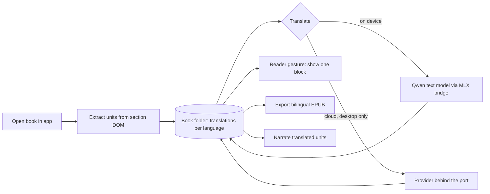

# Integrating tepub into paper-one

Written 2026-09-23. paper-one is the Tauri 2 + React 19 reader that succeeds
Aficionado. Its working notes live in its own gitignored `dev-docs/`, so the
facts below are recorded here with paths relative to the paper-one root. All of
them were read from the tree on this date; none are assumed.

## Verdict

Integrate the capability, not the code.

- Audiobooks: paper-one's narration is better than tepub's on every axis that failed in the grill. Retire tepub's audiobook module rather than port it.
- EPUB writing: paper-one has no writer at all. tepub's writer is the part that must be rewritten anyway, so the byte-copy design from `02-rewriting-tepub.md` becomes paper-one's first writer.
- Translation: paper-one has none, and its ledger records that as a position rather than a gap. Reversing it starts as an ADR and a ledger row, which is the repository's own rule, and only then as a capability.

## What paper-one already has

| Area | Fact | Where |
|---|---|---|
| Architecture | The kernel never imports capabilities. Capabilities compose at build time from `capabilities.manifest.json` with `requires`, `platforms`, optional Rust crate, plugin and permissions. Only `index.ts` is public. The kernel exposes ports with no-op defaults that a composition root injects | `dev-docs/adr/0001-kernel-capabilities.md`, `.dependency-cruiser.cjs`, `scripts/check-boundaries.mjs` |
| Tauri touchpoint | One `lib/wire.ts` per capability may import `@tauri-apps` | Boundary rule `no-tauri-api-outside-plugin-wires` |
| Deletability | `pnpm capability:remove <id>`; `pnpm verify:without` proves the tree builds without each removable capability | `scripts/` |
| Books | Read-only. Each book is a folder `$APPDATA/books/<bookId>/` with the content file, `book.json`, cover and `marks.json`. No zip writer exists | `src/kernel/core/bookFolder.ts` |
| Anchors | Marks store a CFI typed as resolved for the open build, plus exact quote and 32 characters of prefix and suffix; a re-anchor pass re-finds passages by quote across builds | `src/kernel/core/marks.ts`, `resolvedCfi.ts`, `reanchor.ts` |
| Paragraph identity | Section by spine index; block and sentence indices exist in memory only in a `ReadingPlan`. No persistent per-paragraph ids | `src/kernel/ui/reader/readingCursor.ts` |
| Live read-aloud | Web Speech, off on macOS by the owner's rule: no voice rather than a bad one | `src/kernel/ui/reader/speech.ts`, `voiceChoice.ts` |
| Audiobook export | Pure-Rust M4B muxer verified against AVFoundation and ffprobe, AAC by `afconvert`, one chapter per spine section, refuses PDF and pre-paginated. Ledger state Stub, because the voice floor refuses every reachable voice | `src-tauri/src/narrate/` |
| Skippability | Read from `epub:type` and DPUB-ARIA roles, the spec's own vocabulary; notes off by default with a toggle | `src/kernel/ui/reader/speechSkip.ts` |
| Own voices | Kokoro 82M through ONNX with a Rust port of misaki (no espeak), and Qwen3-TTS 0.6B through MLX behind a three-call Swift C ABI. Packs downloaded, pinned by revision, checked by SHA-256. macOS only. Kokoro returns word timings, currently discarded | `src-tauri/crates/tauri-plugin-voices/`, `voices.manifest.json` |
| Not built yet | Reading aloud on the own engines, voice choice in settings, export through the own engines | `dev-docs/plans/phase-30-voices-you-download.md`, WI-30.7 to 30.9 |
| AI | Every AI feature removed on 2026-09-19: companion, gloss, local `llama-server`, cloud routes. The notes record that providers could not be unified | `AGENTS.md`, commit `fefc54f9` |
| Translation | Absent. The ledger: "it needs a provider, a network dependency and a bill, for something a reader can do in another window. Absence there is a position, not a gap" | `dev-docs/feature-ledger.md`, row 309 and Part 4 |
| Reasoning on bilingual display | A permanent translated column puts an L2 reader at full comprehension and zero acquisition. "Ship the gesture, not the mode." Per-block, on demand, collapsing afterwards | `dev-docs/ai-reading-value.md` |
| Headless | The `paper` CLI is generated from the service table. The Node host composes no capabilities and cannot parse EPUBs: no DOM, no foliate outside the webview | `src/cli/`, `src/hosts/node/`, `src/kernel/core/serviceTable.ts` |
| Storage | JSON files, atomic rename, a write queue per key. No SQLite. No general job system | `src/kernel/core/writeQueue.ts` |
| Platforms | Desktop, iOS, Android are Tauri; web is a separate browser build with no capabilities. Phones compose peer, sync, public; voices, circle, webhost are desktop-only | `capabilities.manifest.json`, `src/app/composition.*.ts` |
| Gates | `pnpm verify`: architecture, compositions, boundaries, ledger, test ledger, coverage ratchet, mutation testing at 100% on changed files, all builds, cargo | `scripts/verify.mjs` |
| Vocabulary | "Ledger" means four things here: the feature ledger with states Shipped, Partial, Stub, Absent, Unknown; the test ledger of test names; the sync ledger; the download ledger | `scripts/check-ledger.mjs`, `tests/ledger.json` |

## Where tepub collides

1. **Whole-book side-by-side display is named a trap in the owner's reasoning.** tepub's bilingual EPUB is exactly the mode the note argues against.
2. **Cloud TTS contradicts the posture and solves nothing.** Edge and OpenAI voices exist in tepub to dodge the bad-voice problem that Kokoro and Qwen3-TTS close on device.
3. **The recorded objection to translation has three parts:** a provider, a network dependency, a bill. Today's QwenKit bridge already loads a 2.3 GB model through MLX. The same bridge pattern loading a Qwen3 text model would dissolve all three parts on their own terms. This is a hypothesis: translation quality on that route has not been measured.

## The shape that fits

1. **One capability, `translate`,** desktop first, empty `requires`, Tauri calls confined to its wire file. The kernel gains a translation port with a no-op default, so `verify:without` still passes without it.
2. **Units are extracted in the app,** once per book, from foliate's real section documents, and stored in the book folder beside marks as one file per target language. Each unit carries a CFI, exact quote and context, so the existing re-anchor pass works unchanged on another build of the same work.
3. **Translation is text to text and runs anywhere:** inside the app as a between-sessions job with progress and cancel, like the audiobook export, or headless from the CLI through a `translation.*` group in the service table.
4. **The reader shows the gesture.** Tap or select a block and its translation appears beneath it and collapses again. A filled cache makes that instant. No permanent column mode exists.
5. **Two provider routes behind one port:** on-device Qwen through the MLX bridge first; cloud providers second, desktop only, keys in the keyring the peer plugin already uses. The port takes a unit and returns text; the inline-markup contract is validated on paper-one's side.
6. **Bilingual export is a separate export service,** the repository's first EPUB writer, built to the byte-copy design and gated on epubcheck. It sits beside the M4B export, not in the reading surface.
7. **Two features neither project has fall out:** a translated audiobook is the translated units narrated by the Chinese voice; Media Overlays are Kokoro's word timings joined to per-unit anchors.



### Unit record, sketch

```json
{
  "id": "u-000123",
  "section": 4,
  "anchor": { "cfi": "epubcfi(/6/10!/4/2/14)", "exact": "Call me Ishmael…", "prefix": "", "suffix": "Some years ago" },
  "kind": "block",
  "sourceHtml": "<p>Call me Ishmael. …</p>",
  "translations": {
    "zh": { "html": "<p>叫我以实玛利。…</p>", "route": "qwen-mlx", "at": "2026-09-23T00:00:00Z", "checked": true }
  }
}
```

`checked` records that the inline-markup contract held. A unit whose contract
failed keeps the source and records the failure; nothing is silently accepted.

### Where each step can run

| Step | App webview | Node host and CLI | Rust |
|---|---|---|---|
| Extract units | Yes, from foliate section documents | No, no DOM | No |
| Translate | Yes | Yes, from stored units | Possible through the MLX bridge |
| Show the gesture | Yes | No | No |
| Export bilingual EPUB | Yes | Yes, no DOM needed for a byte-copy writer | Possible |
| Narrate translated units | Through the voices plugin | No | Yes |

## What carries over from tepub

Almost no code. Knowledge survives: the front and back matter keyword rules,
the refusal and truncation patterns, the prompt and glossary ideas, and the
defect list in `01-improving-tepub.md` as a test suite for the new writer.
cjk-typography already covers CJK polish. Once `paper translation` exists,
freeze tepub at 0.3.3 with a README pointer.

## Effort

paper-one's gates raise the cost per line: a ledger row and test-ledger entries
per surface, coverage ratchets, mutation testing at 100% on changed files.

| Work | Agent-hours |
|---|---|
| ADR, ledger reversal, unit schema, port design | 3 to 4 |
| On-device route through the MLX bridge, quality measured against a cloud baseline | 4 to 8 |
| Capability skeleton, store, extraction in the app, gesture UI | 6 to 10 |
| Background job, progress, service-table rows, CLI | 4 to 6 |
| EPUB writer, bilingual export, epubcheck gate | 6 to 8 |
| Cloud route, keyring, settings section | 3 to 4 |

Clock time is dominated by model downloads and by measuring translation
quality on real chapters.

## First steps, in order

1. **Measure the on-device hypothesis** before designing around it: a Qwen3 text model through the existing bridge on three chapters, Chinese and English both ways, scored against a cloud baseline and timed. Record memory held and after unload, as the TTS commits do.
2. **Write ADR 0003** with the reversal stated in the ledger's own terms: what changed since the position was recorded, what the gesture is and is not, which route is default, and what would reverse it again.
3. **Add the ledger row** as Stub while building, with the `Where` paths, and let `pnpm ledger:check` hold it.
4. **Build the port, the unit store and extraction first.** The gesture UI, the job, the export and the CLI rows each land on that foundation and each can be deleted without the others.

## Open questions for the owner

- Is the reader for whom translation is built an L2 learner, or someone reading a book in a language they cannot read at all? The acquisition argument applies only to the first, and the answer decides whether the export deserves to exist.
- Should translations sync between devices through the sync capability, like marks? They are anchored the same way, so the cost is small and the benefit is real.
- Which language pairs matter first? That decides the on-device model choice and the memory floor for the pack.
