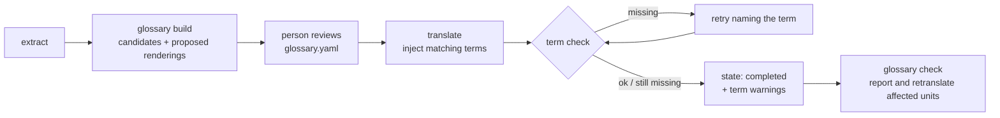

# Glossary consistency: how professionals do it, and what tepub should copy

2026-10-05. Question: how do professional translators keep terms consistent
across a long text, and which of their mechanisms carry over to a tool that
translates a book one unit at a time with a language model?

## The problem, measured on a real run

tepub has no glossary. Every unit is translated alone, so nothing ties one
paragraph's choice of word to the next. On the first 124 translated units of a
nonfiction book about Southeast Asian scam compounds (TranslateGemma 12B,
English into Simplified Chinese), the book's central term came out like this:

| Source term | Renderings seen, with counts |
|---|---|
| (scam) compound | 园区 10, 诈骗中心 9, 场所 6, 设施 6, 集中营 5, 诈骗营地 4, 中心 4, 诈骗集中营 3, 诈骗园区 3, 诈骗窝点 2 |
| Sihanoukville | 西哈努克市 (most), 西哈努克维尔 1, 西哈努克省 1 |
| trafficked | 贩卖 14, 贩运 6 |
| Cambodia | 柬埔寨 51 (consistent, because the name is standard) |

The counts come from a regular-expression scan of units whose source contains
the term, so a few hits are other words (设施 can translate "facility"). The
shape is not in doubt. A reader meets ten names for one thing and cannot tell
whether they are ten things. Standard names, such as Cambodia, are already
consistent. The damage falls on the book's own key terms and on names without
one settled form. Those are exactly the terms a glossary exists for.

## What professionals do

The industry practice has three stages, and the tools are built around them.

### 1. Decide before translating

- **A termbase.** This is a database of approved terms. Each source term
  carries its approved target term, terms to avoid, a definition, and a usage
  note. It records decisions; it is not a dictionary of everything. The
  exchange format is TBX (ISO 30042), which every major tool imports. Phrase
  ([term bases](https://support.phrase.com/hc/en-us/articles/5709733372188),
  [best practices](https://phrase.com/blog/posts/term-base/)) and XTM
  ([TBX integration](https://xtm.cloud/lp/xtm-bridge-tbx-integration)) are
  typical examples.
- **Term extraction comes first.** A project manager or lead translator pulls
  candidate terms from the source. Candidates are frequent noun phrases,
  proper nouns and invented words. The team decides each one before the
  translation starts, so that several translators make the same choice
  ([Science Co. on glossaries and style
  guides](https://www.science.co.jp/en/localization/termlist.html)).
- **In literary work, a style sheet.** It is also called a "bible". It lists
  character names, places, invented terms, honorifics, recurring phrases, and
  the romanisation rule, with notes on each choice. It is the same idea as a
  termbase, kept by the translator and the editor. Web-fiction translation
  communities treat it as mandatory, because name drift "destroys reader
  trust".

### 2. Show only the relevant terms, at the moment of use

- Inside a CAT tool (computer-assisted translation), the termbase is not read
  up front. As each sentence opens, the tool looks up which glossary terms
  occur in it and shows only those, with their approved targets. The
  translator sees 2 entries, not 2,000.
- A **translation memory** sits beside it. It is a store of earlier
  sentence pairs that offers exact and near matches. The termbase decides
  which word is right; the memory shows how that word was used in a whole
  sentence ([overview](https://thaonco.com/translation-times/technology/termbase/)).

### 3. Check afterwards, mechanically

Dedicated QA tools such as Xbench and Verifika, and the QA built into CAT
tools, run checks that need no judgement
([Xbench overview](https://amvietnam.com/translation-quality-assurance-with-xbench/),
[ProZ thread on Xbench](https://files.proz.com/forum/proofreading_editing_reviewing/352132-what_is_xbench_used_for.html),
[QA tool comparison](https://www.rajeshkumar.xyz/blog/localization-qa-tools/)):

| Check | Rule |
|---|---|
| Term check | The source contains a glossary term, so the target must contain its approved rendering. |
| Forbidden terms | The target must not contain a rendering marked "avoid". |
| Inconsistency, by source | The same source sentence or term was translated differently in two places. |
| Inconsistency, by target | Two different source terms became the same target word. |
| Tags and numbers | Placeholders, tags and numbers match. tepub's markup contract is this check. |

The output is a report that a human works through. Checks flag problems;
people decide what to do about them.

## What machines do

### Translation engines: glossaries as constraints

- **DeepL.** A glossary is sent with each request (`glossary_id`), and only
  when `source_lang` is set, because glossaries do not work with automatic
  language detection. Entries are flexed, not pasted: "DeepL intelligently
  flexes entries to account for case, gender, tense, and other grammar
  features." A glossary has no duplicate sources, and each entry is at most
  1,024 bytes ([DeepL glossary
  docs](https://developers.deepl.com/docs/customize/managing-glossaries.md),
  [support](https://support.deepl.com/hc/en-us/articles/360021634540)).
- **Google Cloud Translation (Advanced).** When the API meets a glossary
  term, it uses your translation instead of its own. Matching is
  case-sensitive by default, with a stopword list. Glossaries are either
  one-directional pairs or equivalent-term sets across many languages
  ([Google glossary docs](https://docs.cloud.google.com/translate/docs/glossary)).

### Language models: inject, then verify, then revise

- **Inject only what matches.** The working pattern is to find the glossary
  terms that occur in this segment and put just those pairs in the prompt,
  as a list or table. This is the CAT-tool idea in prompt form. Dumping the
  whole glossary into every prompt wastes context and dilutes attention
  ([Translated on prompting for domain
  accuracy](https://translated.com/resources/prompt-engineering-for-translation-guiding-ai-domain-accuracy),
  [Lokalise on AI glossaries](https://lokalise.com/blog/ai-translation-glossary/)).
- **Models ignore constraints.** Huang et al. found that language models
  "disregard translation constraints due to overconfidence in their initial
  outputs". Their fix was a second pass that names the unmet constraints and
  asks for a revision. It improved constraint accuracy by about 15% over
  plain prompting, across four tasks ([Translate-and-Revise, arXiv
  2407.13164](https://arxiv.org/abs/2407.13164v1)). This is the same move as
  tepub's markup retry, which names what went missing.
- **Shared-task evidence.** The WMT25 terminology task compared three
  conditions: no terms, the proper terms, and random terms. Proper
  terminology "consistently boosts both overall translation quality and term
  accuracy". Document-level translation, in finance from English to
  Traditional Chinese, "still falls short"
  ([findings](https://preview.aclanthology.org/setup/2025.wmt-1.30),
  [one participant's paper](https://arxiv.org/pdf/2510.17504)). One summary
  reports that term accuracy with the proper terms was only about 0.40 to
  0.55. I have not verified that figure against the findings paper, which
  would not load. Read it as "injection helps, and is far from sufficient
  alone".
- **Build the glossary automatically, then have a person review it.**
  Kim et al. extract terms with a trie (a prefix-tree index) and teach the
  model to use them, which won the WMT24 patent task
  ([arXiv 2410.15690](https://arxiv.org/abs/2410.15690v1)). In practice,
  people ask a model to list the key terms and proper nouns, each with a
  proposed rendering and a keep / translate / adapt decision. A person then
  reviews the list
  ([example workflow](https://freeacademy.ai/es/lessons/ti-terminology-glossaries),
  [term extraction plus inconsistency
  detection](https://wisetranslate.notion.site/Extract-terms-and-fix-inconsistencies-27c90ffc4ce749509bbcc3606f46b411),
  [tolingo on human and AI terminology
  work](https://www.tolingo.com/en/blog/terminology-management-between-human-expertise-and-ai)).

## What carries over to tepub

The professional pipeline maps onto tepub's own stages almost one for one, and
tepub already has the hardest piece: a per-unit contract with a named retry.

### Recommended design

1. **A per-book `glossary.yaml` in the workspace.** It is human-readable and
   diffable, and it can be exported to TBX later if anyone needs it. Each
   entry has a source term, its variants (inflections such as "compounds"),
   the target, an optional `keep: true` for names left untranslated, terms
   to avoid, and a note. A global glossary in `~/.tepub/` holds terms shared
   across books, and book entries override it.
2. **`tepub glossary build`, run after extract.** It finds candidates by
   frequency: capitalised word sequences (proper nouns) and frequent noun
   phrases. Many nonfiction books also have an **index**, a ready-made list
   of what the author thinks matters. tepub currently skips the index as
   back matter, but it is the best source of candidate terms there is. A
   model then proposes a rendering for each candidate from two or three
   context sentences. The person edits the list, and nothing is used until
   it is saved. Deciding before translating is the one practice every source
   agrees on. Letting the first occurrence decide would lock in whatever the
   model said first, which is the failure seen above.
3. **Inject only matching terms at translation time.** Each unit's source
   is matched against the glossary, on whole words and listed variants, and
   only those pairs are added to the prompt. They are appended, as the mode
   instruction now is, so that a custom preamble cannot drop them.
4. **Check terms like the markup contract, with a different outcome.** If
   the source contains a term and the reply lacks its target, retry once
   with the term named (translate-and-revise). Then **accept with a
   recorded warning instead of failing**. A translator can legitimately
   avoid repeating a term, for example by using a pronoun, so a missing
   term is not proof of an error the way a missing link is. Failing would
   leave paragraphs untranslated over a style choice.
5. **`tepub glossary check` as the QA report.** For each term, it lists the
   units whose source has the term and whose translation lacks the approved
   rendering, plus any forbidden renderings found. With `--retranslate`, it
   sends only those units again. This is also how a book that is already
   translated gets fixed after the glossary is added, without redoing the
   whole book.
6. **DeepL gets a real DeepL glossary** through `glossary_id`, created from
   the same file, and the term check still runs afterwards. DeepL requires
   an explicit source language for this; tepub's default is `auto`, so the
   glossary path must require `--from`.

### What must be measured before building it

- **Does TranslateGemma follow injected terms?** Measured 2026-10-05 on 10
  paragraphs containing "compound": without the term in the prompt, 0 of 10
  used 园区; with it, 10 of 10. The rest of this item is the original
  question. It was trained on a fixed
  prompt format, and extra instructions may be weaker for it than for a
  general chat model. Run the 20-paragraph sample with and without injected
  terms, and count the term-follow rate. If it is low, the
  translate-and-revise retry carries the weight, and the trade-off between
  cost and gain changes.
- **Matching for terms that inflect.** English plurals are easy to list.
  Languages with heavy inflection need stemming or listed variants. List
  the variants first, because it is explicit and testable.
- **The false-positive rate of the term check** on a translated book. If
  pronoun use makes it flag 30% of units, the report is noise, and the
  check needs a looser rule, such as "the term appears at least once per
  chapter".

### Effort

About 4 to 6 agent-hours, most of it mechanical: the file format, matching,
injection, the check and the report command. The irreducible part is the
candidate extraction heuristic and the warn-versus-fail policy, roughly 1
hour. Waits are clock-time on the local model: measuring the term-follow
rate on 20 paragraphs takes about 5 minutes, and re-translating the affected
units of one book takes 10 to 30 minutes.
